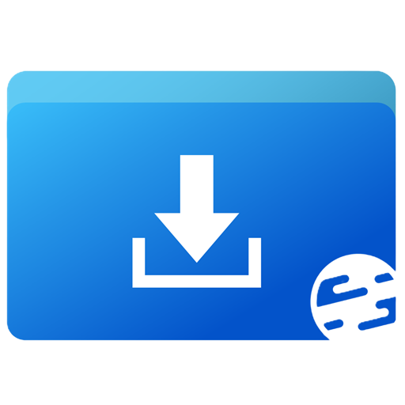

<div align="center">


# ClassSoftwareHub · Windows 7 移植版

**电教委员常用软件下载站 · 桌面客户端（Windows 7 移植版）**

[](https://github.com/c1201y/ClassSoftwareHub-windows7)
[](https://github.com/c1201y/ClassSoftwareHub-windows7/releases)
[](LICENSE)
[](https://dotnet.microsoft.com/download/dotnet/6.0)
[](https://avaloniaui.net/)
[](https://github.com/c1201y/ClassSoftwareHub-windows7)

ClassSoftwareHub 桌面版 —— **Windows 7 移植版**（代号 `csh-win7`）。把「电教委员常用软件下载站」装进教室里的老机器：内容跟随网站自动更新，提供软件下载、常用工具与工具侧边栏，断网时回退到离线副本。本版用 **Avalonia** 重做了 UI 层，把系统底线降到 **Windows 7 SP1**，布局、间距、圆角、颜色、图标、文案都与原版 1:1 对齐。

- 网站：[classsoftwarehub.us.ci](https://classsoftwarehub.us.ci)
- 原版（WinUI 3 / Windows 10 1809+）：[c1201y/ClassSoftwareHub-Desktop](https://github.com/c1201y/ClassSoftwareHub-Desktop)
- 网站源码：[c1201y/ClassSoftwareHub](https://github.com/c1201y/ClassSoftwareHub)

</div>

## 为什么有这个仓库

原版用 **WinUI 3**，系统底线是 **Windows 10 1809** —— 教室里的老机器（Windows 7 SP1）装不上、也升不动。本仓库把 UI 层换成 **Avalonia 11.2.8 + .NET 6**，重做一套能在 Win7 上跑的外壳，界面与交互对齐原版。

两版**各自独立发布、各自独立更新**：本仓库就是 Win7 版自己的更新源 —— 客户端的「检查更新」和「更新日志」只读本仓库的 Release，不会收到另一个版本的更新。

## 功能

- **软件下载**：按分类浏览常用软件，查看详情、系统限制、版本号、体积与校验值，并提供文件直链下载；软件清单跟随网站数据自动更新。
- **全站搜索**：一次搜索软件、内置工具与页面，快速定位。
- **常用工具**：随机摇号、课表计时、秒表计时、全屏时钟、编码 / 哈希、图片取色、系统镜像下载等，开箱即用。
- **工具侧边栏**：可自己拼装 —— 把常用工具拖进侧边栏、排顺序、拖出去删掉；四条边都能贴，鼠标和手指都拖得动。
- **截屏贴图**：拖一块屏幕区域即可编辑（画笔 / 荧光笔 / 箭头 / 矩形 / 椭圆 / 文字 / 马赛克），支持撤销重做、复制、存盘与钉图。
- **外观**：主界面与外部小窗可各自使用浅色 / 深色。
- **自动更新**：内置双通道更新器（正式版 / 预览版），自动核对版本、下载并校验安装包。
- **更新日志**：站内直接查看历史版本的更新说明。
- **数据容错**：单条数据异常不影响整站，页面顶部给出明确提示。

## 下载

到 [Releases](https://github.com/c1201y/ClassSoftwareHub-windows7/releases) 下载，两种形态任选：

| 形态 | 文件 | 说明 |
| --- | --- | --- |
| **安装版** | `ClassSoftwareHub-Setup-win7-dv<版本>.exe` | Inno Setup 安装包，装「启动器 + `app\` 子目录」，带开始菜单 / 桌面快捷方式与卸载项 |
| **便携版** | `ClassSoftwareHub-Portable-win7-dv<版本>.zip` | 解压即用，双击根目录的启动器运行，不写注册表 |

- 系统要求：**Windows 7 SP1 及以上**（.NET 6 在 Win7 上的底线就是 SP1）。
- 与原版（WinUI 3 版）**可同机共存**：安装目录与安装标识都不同，互不覆盖。
- 每个安装包都附带同名 `.md5`，下载后可校验完整性。

## 技术选型，不要升级

| 组件 | 版本 | 为什么不能动 |
| --- | --- | --- |
| .NET | **6.0** | 最后一个官方支持 Windows 7 的 .NET 版本 |
| Avalonia | **11.2.8** | 支持 `net6.0`；12.x 的 baseline 更高，Win7 / D3D11 上跑不了 |
| FluentAvaloniaUI | **2.4.1** | 支持 `net6.0`；2.5+ 依赖 `net10` |
| WebView2 SDK | **≤ 1.0.1587** | Win7 上 WebView2 运行时止于 109.0.1518.x |

> 与原版的 1:1 对齐要求与移植记录见 [`src-win7/PORTING.md`](src-win7/PORTING.md)。

## 目录结构

```
src-win7\            移植版全部源码（Avalonia 工程）
  Launcher\          便携版启动器（产物根目录那一个 exe）
  Core\              外壳常量、版本号、更新通道等
  Services\          更新、数据、站点桥接等
  Pages\             各页面
  Views\             各窗口
Assets\              构建需要的图片 / 图标资源
Web\                 站点外壳脚本
installer\           Inno Setup 安装脚本
tools\               打包与发版脚本
.github\workflows\   构建 / 发版工作流
```

## 编译 / 打包 / 发版

见 [BUILDING.md](BUILDING.md)（本地构建、便携版 / 安装版组装、tag 触发与手动发版、版本号规则）。

## 获取帮助 & 加入社区

- 问题反馈：[GitHub Issues](https://github.com/c1201y/ClassSoftwareHub-windows7/issues)
- QQ 群：[487903798](https://qun.qq.com/universal-share/share?ac=1&authKey=vefxPhZAIezynTibFDvI6%2Fk6IdFyykc%2BWJeWDWkhazM7y8LSXhKcbZwaVYM3anw2&busi_data=eyJncm91cENvZGUiOiI0ODc5MDM3OTgiLCJ0b2tlbiI6IlBkZ1FQaWtaQVAybEVEckl3QzBlay85ZzduU3VlblRwTWc5RlVKNWFCUFExSTdvMmJQQjB6V2VacFR1UEdvaHciLCJ1aW4iOiIzOTA0MjE1ODUzIn0%3D&data=pICf64tVKQTKypKZDhfKmNpcj4j6fS-LGeREZiBQnbWrokAMTdULxqLbm2JHCTIPqwgpG2pSPisQKg0QdbEIJvTU_e6wUDNbHUVTnTswsR8&svctype=5&tempid=h5_group_info)
- 投喂作者：[爱发电 · TinyNickCSHub](https://afdian.com/a/cyan1201)

## 贡献

欢迎提交 Pull Request 或 Issue。提交前请先阅读 [`BUILDING.md`](BUILDING.md) 与 [`src-win7/PORTING.md`](src-win7/PORTING.md)，了解构建流程与「与原版对齐」的约定。

## 致谢

- [Avalonia](https://avaloniaui.net/) —— 跨平台 UI 框架
- [FluentAvaloniaUI](https://github.com/amwx/FluentAvalonia) —— Fluent 风格控件库
- [WinUIonWeb](https://github.com/Furry-Xiyi/WinUIonWeb) —— 网站使用的 WinUI 风格 Vue 组件库
- 以及所有贡献者

## 许可证

本项目与 [ClassSoftwareHub](https://github.com/c1201y/ClassSoftwareHub) 一致：**GPL-3.0**，详见 [LICENSE](LICENSE)。

<div align="center">

Copyright © 2026 椰汁 . All rights reserved.

</div>
